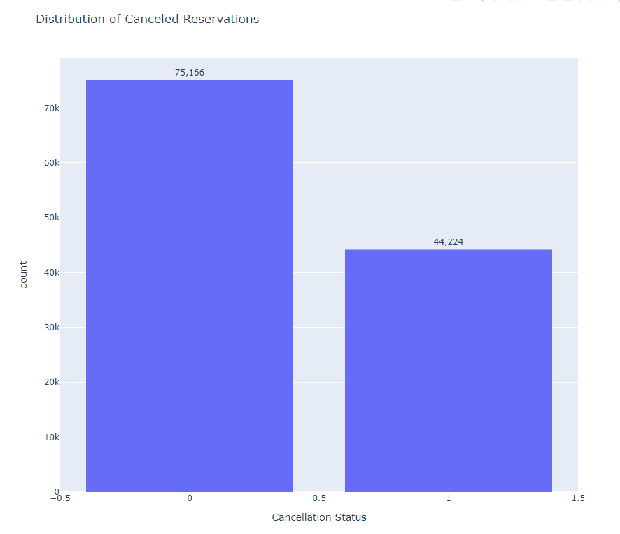
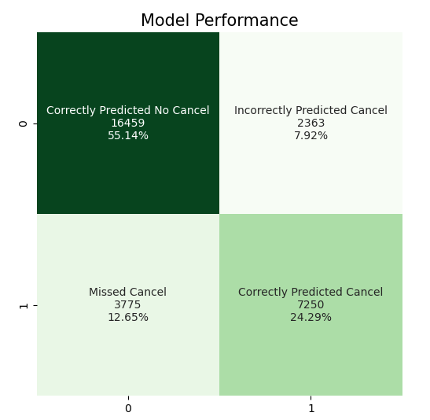

#  Eco Oasis Suites: Investigating Hotel Reservation Cancelations


## Overview

Last-minute cancelations leave hotels and resorts today with minimal time to fill the vacant rooms which hurts overall profitability and lowers occupancy rates. This project focuses on the invented "Eco-Oasis Suites" hotel chain that wants to build a tool that will allow them to flag reservations at risk for cancelation to launch targeted intervention strategies and retain bookings. 

For the purpose of the project, I acted as a Data Scientist working for Eco-Oasis to build 3 classification models by analyzing over 119 thousand reservations. This data was extracted from [Kaggle](https://www.kaggle.com/datasets/khairullahhamsafar/hotels-booking-data-cleaned-version/data) on a City and Resort hotel with informaion on reservation lead time, deposit type, meal vouchers, distribution channels, etc. The canceled reservations were flagged with a binary indicator, with 1 indicating a canceled reservation. These were the reservations I evaluated the model's prediciton performance on using a recall score. 

The winning classification model used Random Forest and identified canceled reservations (reservations in class 1) 68% of the time. This was a 7 percentage point improvement from the baseline model. With continual monitoring, regular updates to the data, and collaboration with cross-functional teams, leveraging this model internally at Eco-Oasis would help flag canceled reservations with enough lead time to enact intervention strategies and enhace guest satisfaction. 

This project can be reproduced in Google Colab. 

## Business Problem

Eco Oasis Suites is a new chain of fully sustainable and eco-friendly hotels. With features such as green rooftops and solar panels, the chain has established itself as a pioneer in the industry, attracting environmentally conscious travelers. However, the business is currently grappling with an increasing number of canceled reservations, posing a significant challenge to its overall profitability.

The last-minute nature of these cancelations leaves the hotels with minimal time to fill the vacant rooms before the scheduled arrival dates. This not only leads to missed revenue opportunities but also disrupts the operational efficiency of the hotel. The need to address this problem has prompted the chain to seek a proactive solution – a tool that can help identify reservations at risk of cancelation well in advance in order to allow for intervention. 

Once the tool identifies reservations at risk of cancelation, Eco Oasis Suites can launch targeted interventions to encourage guests to retain their bookings. Possible interventions may include offering meal vouchers, exclusive promotions, room upgrades, or personalized incentives aligned with the brand's sustainability values. The goal is not only to minimize cancelations but also to enhance guest satisfaction and loyalty.

## Data Understanding and Exploration 

The data comes from one dataframe with 32 variables. The target varaible is "is_canceled" which is a binary indicator with 1 incdicating a canceled reservation and 0 meaning otherwise. 

<i>Data Types: </i>Columns such as Agent and Company are stored as numerical features, but since they are ID numbers, they shouldn't be treated as numercical values in the model. I will exclude them from the model. 

<i>Distribution of the Target:</i> The distribution plot for the target variable shows a class imbalance with 44k canceled reservations versus 75k non-canceled reservations. This suggested that [SMOTE](https://www.geeksforgeeks.org/ml-handling-imbalanced-data-with-smote-and-near-miss-algorithm-in-python/) should be tested to improve recall on the model. 




<i>Categorical Values:</i> By looking at the value counts for the categorical values, I identified which would be useful to test in the model. Columns that had months or dates (not stored as date type objects) will be excluded. 

<i>Numerical Values:</i> There are no significant correlations between variables that would indicate any are accounting for the same variation. The highest correlation to "is_canceled" is "lead_time" with a .29. It will be interesting to see if this is an important variable in the models using Feature Importance later on. 


## Model Iterations 

Three models were built to identify reservations that are likely to cancel: 

<b> - Baseline Decsion Tree Classifer </b> 

Precision: For class 0, it's 0.80, meaning that when the model predicts a sample belongs to class 0, it is correct 80% of the time. For class 1, it's 0.79, indicating 79% accuracy in predicting class 1 instances.

Recall: For class 0, it's 0.90, suggesting that the model correctly identifies 90% of all actual class 0 instances. For class 1, it's 0.61, meaning that the model identifies 61% of all actual class 1 instances.


<b> - Random Forest (using SMOTE) </b>

Precision: For class 0, it's 0.82, meaning that when the model predicts a sample belongs to class 0, it is correct 82% of the time. For class 1, it's 0.72, indicating 72% accuracy in predicting class 1 instances. For Class 0 the precision went up 2 percentage points, while it went down 7 percentage points for Class 1. 

Recall: For class 0, it's 0.85, suggesting that the model correctly identifies 85% of all actual class 0 instances. For class 1, it's 0.68, meaning that the model identifies 68% of all actual class 1 instances.

<b> - Random Forest with GridSearch identified hyperparameters (using SMOTE) </b> 

The optimal parameters identified were: 
- criterion: entropy
- max_depth: None
- min_samples_leaf: 3
- min_samples_split: 10
- n_estimators: 100

Precision: For class 0, it's 0.81, meaning that when the model predicts a sample belongs to class 0, it is correct 81% of the time. For class 1, it's 0.75, indicating 75% accuracy in predicting class 1 instances. For Class 0 the precision went down by 2 percentage points, and it went up 3 percentage points for Class 1. 

Recall: For class 0, it's 0.88, suggesting that the model correctly identifies 88% of all actual class 0 instances. For class 1, it's 0.66 meaning that the model identifies 66% of all actual class 1 instances. This is a slight improvement for Class 0 but two percentage points lower for Class 1. 


## Final Model Selection

The selected model is the Random Forest without applying any of the hyperparameters found in while running Gridsearch. This decsion was taken by focusing on the recall score for Class 1. 

This model has a recall score of 68% which means that it identifies correctly 68% of actual Class 1 instances. This is a 7 percentage point increase from the Baseline model. 

By focusing on the recall score, the evaluation is focused on minimizing false negatives. These would be cases where a reservation was not flagged as at risk for cancelation, but then it was canceled, as these pose a higher risk to the Hotel. The confusion matrix also reveals that the model only missed 12% of cancelations. 




## Conclusion and Next Steps

The development of this classification model for identifying reservations that are at risk for cancelation is a step towards optimizing operational efficiency and revenue management for Hotels. 

<b> The benefits of deploying this model include: </b> 

- Enabling proactive intervention strategies by flagging reservations deemed at risk of cancelation, allowing hotel management to allocate resources effectively and implement targeted retention efforts. By identifying high-risk bookings in advance, hotels can tailor personalized incentives or communication strategies to mitigate cancelations and preserve revenue streams.

- Providing valuable insights into the underlying drivers of cancelations. The model sheds light on factors such as booking lead time, pricing dynamics, seasonal trends, and customer demographics. 

<b> Next Steps: </b> 
- Continual monitoring and evaluation of model performance will be crucial to ensure its effectiveness and reliability over time.
- Regular updates and iterations based on real-time data insights will ensure that the model remains agile and responsive to changing business environments.
- Collaboration with cross-functional teams, including revenue management, marketing, and customer service, will facilitate the integration of the classification model into broader business strategies and decision-making processes.


## Repository Structure 

```
├── README.md: The top-level README for reviewers of this project
├── index.ipynb: Jupyter Notebook file where analysis was conducted 
├── Eco Oasis Suited Canceled Reservations.pdf: PDF version of project presentation
├── data: Sourced from Kaggle
├── images: Sourced externally and graphed results from the index file
```